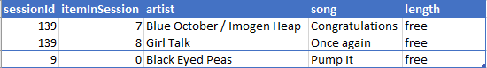
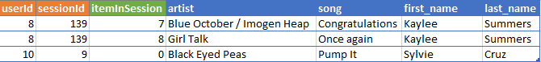
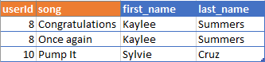

# Data-Modeling-with-Cassandra
Data-Modeling-with-Apache Cassandra (Udacity: Data Engineering Nano Degree) | learngvrk@gmail.com | 2019-12-27 This project is a part of Udacity's Data Engineer Nano Degree.

## Project 2 - Data Modeling with Apache Cassandra

<b>Courtesy:</b> Adobe Stock Images

### Background:
The startup Sparkify was interested to analyze the data collected from the user activity on their music app on the mobile phones.

Based on the user activity the startup would like to perform some analytics to derive insights which will help the organization to better understand the user behavior, and so add more interesting features to their mobile app which would enhance the user experience and stratergize the product development roadmap.

### Business Need:

The business is looking to answer the following questions or would like to analyze the data obtained from the answer (query results).
<b>
1. Give me the artist, song title and song's length in the music app history that was heard during sessionId = 338, and itemInSession = 4
2. Give me only the following: name of artist, song (sorted by itemInSession) and user (first and last name) for userid = 10, sessionid = 182
3. Give me every user name (first and last) in my music app history who listened to the song 'All Hands Against His Own'
</b>

### ETL Pipeline for Pre-Processing the Files

<ol>
<li> Find all the sub-directories, files (event-log data) within the sub-directories within the files.
<li> Identify all the files within the sub-directories and create a list of file(s) absolute path.
<li> Loop through each of the file name and Open the file (.csv)
  <ol>
  <li> Skip the first line in the file
  <li> Read through the lines in rest of the file and append it to list
  <li> Close the file
  </ol>
<li> Open a new csv file
<li> Loop through the list created earlier
  <ol>
  <li> Ignore the list item if the artist_name is Empty.
  <li> Write the selected list items to each line of the .csv file
  </ol>
<li> Close the csv file.
</ol>

### Database Schema

- For Apache Cassandra, the best strategy would be to have <b>one TABLE per one QUERY.</b>
- Artists, Users, Songs are dimensions needed to build the tables, which is then used to derive insights.
- Since these tables are used for analytics they are expected to be <b>DE-NORMALIZED.</b>

### Perform Denormalization
> 1. Ensured the Fact tables have all the primary keys of the Dimension tables.
> 2. All the categories of the Dimension tables are included within the Fact tables.
> 3. All the required measures can be calculated using the aggregation function performed on the categories (data).

### Rules for Constructing Tables
> 1. Apart from the fields/columns requested in the queries the other fields required are.
>> 1. Fields part of WHERE clause.
>> 2. Fields needed to create Partition Keys and Clustering Keys
> 2. Partition Keys and Clustering Keys are determined based on the product usage and business knowledge.
> 3. <b>JOINS</b> are not allowed in Apache Cassandra and so we do not follow Normalization techniques while designing the tables

### SQL Queries
<ol>
  <li> Establish connection to the local instance of the Apache Cassandra with replication factor=1.</li>
  <li> Create CREATE TABLE statements to create tables per query.</li>
  <li> Create INSERT INTO TABLE statements to enter the event data into the tables.</li>
</ol>

### Convert Jupter Note Book Code into Modular Python code (.py) file
1. Convert the Python Scripts from the web kernel to modular Python code (.py) file.
2. Create common functions to perform the database and ETL functions.
